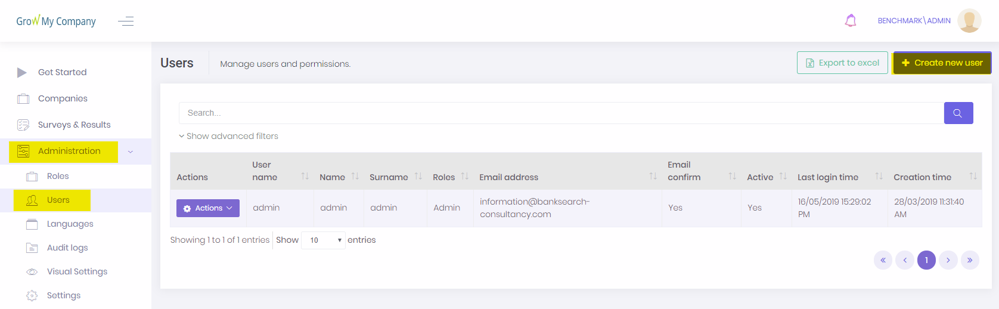
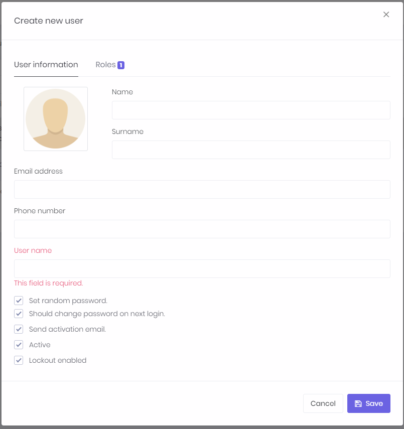

## Create New User

As an administrator, you can create new users from directly within the administration section.

1. Click Administration
2. Click Users
3. Click 'Create new user'

### User information

On this screen, enter the required information.

### Roles

There are two roles available:

- Admin - is able to view all companies as well as view/edit/delete companies/surveys that belong to user and access admin features
- User - is able to view/edit/delete companies/surveys that belong to user