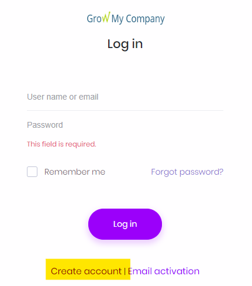
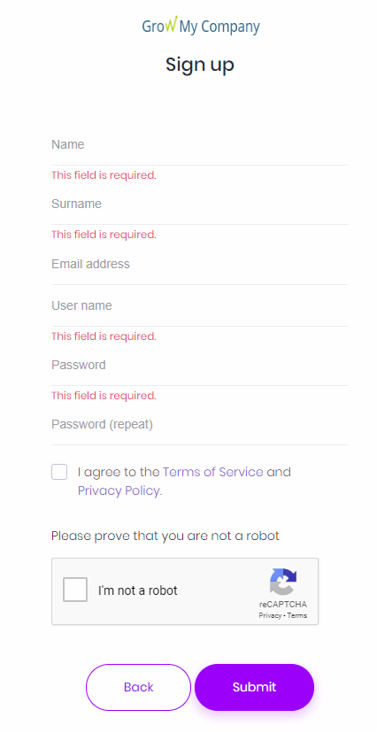

## Create account

* Navigate to your tenant login page:

  * if you are an admin you will have received this by email
  * your Business Support Partner will have shared this with you
  * [you want to complete the survey now](https://benchmark.growmycompany.co.uk)
  * [you want to test out the system](https://demo.growmycompany.co.uk)

* Click 'Create user'

* Enter your details and click 'Submit'

* An email will be sent to your email address, click the link in the email to verify your email address.

Note: Tenant admins can [create users](create-account-admin.md) in the Admin section.
